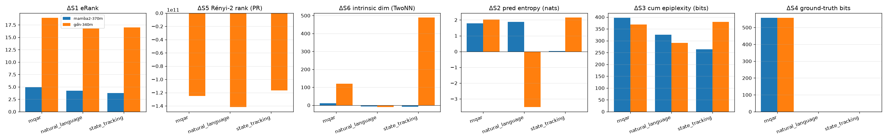
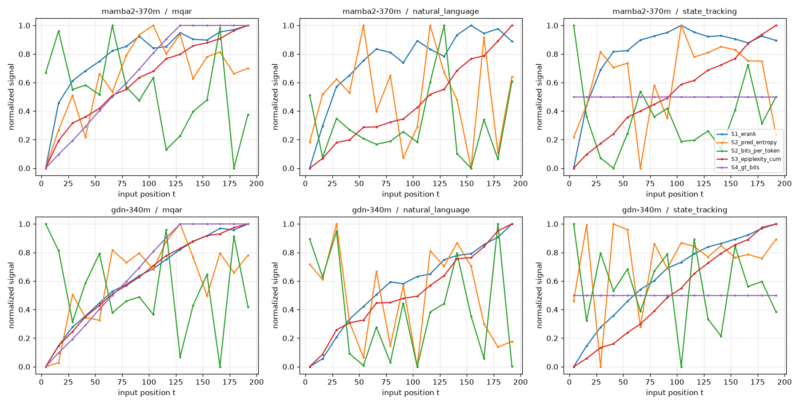
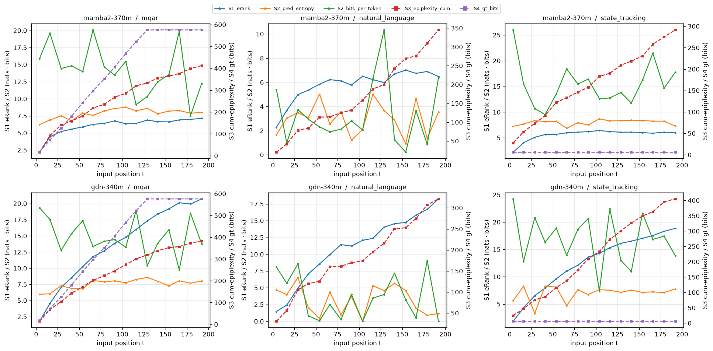
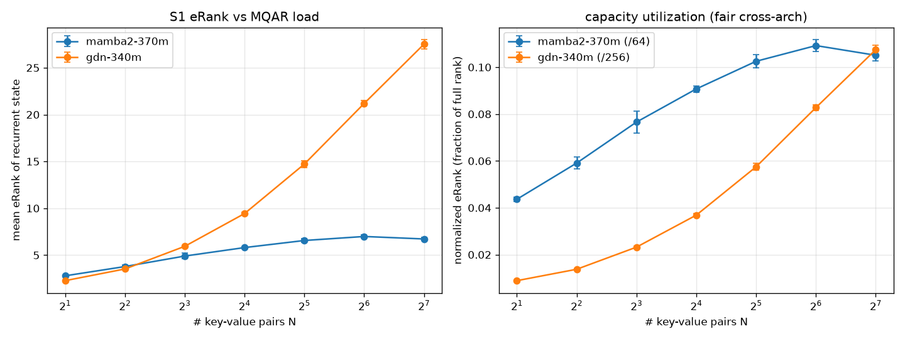
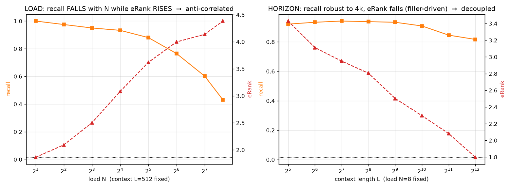
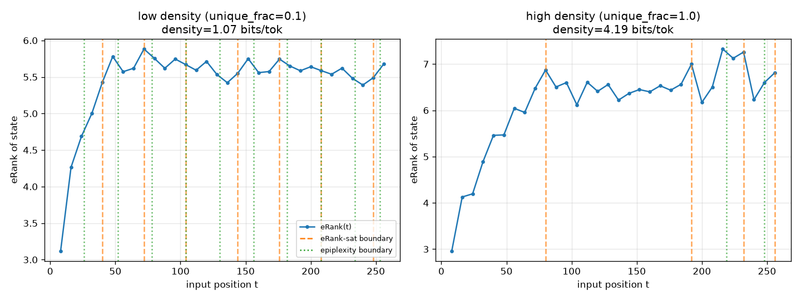
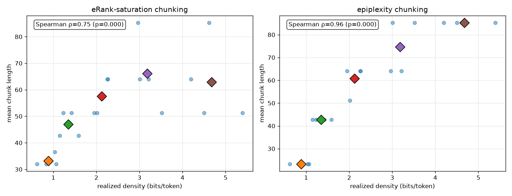
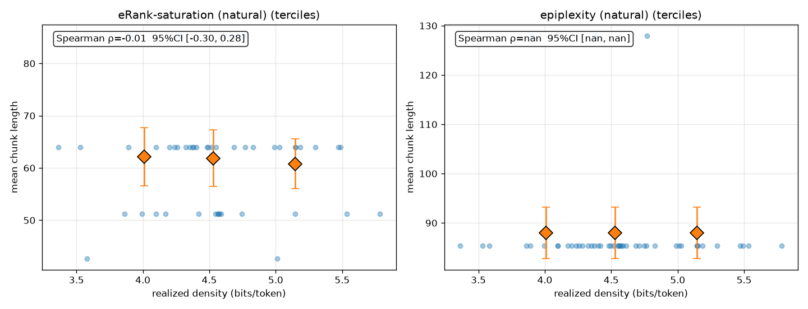
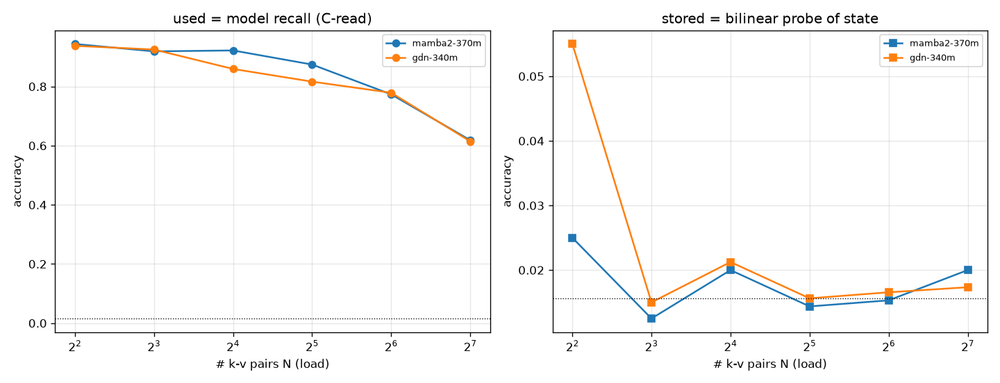
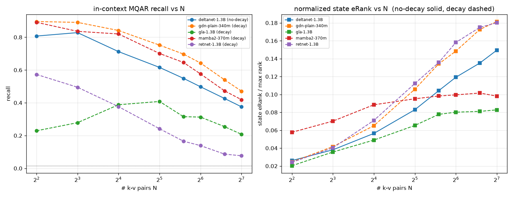

> 🇬🇧 English version: [`REPORT.md`](REPORT.md)

# 고정 크기 recurrent state의 정보 용량 — 중간 보고서

고정 크기 recurrent LM(Mamba-2 SSD 대 Gated DeltaNet)에서 연상 recall을 무엇이 제한하는지, 어떤 정보이론 신호가 그것을 잘 추적하는지, 정보 밀도가 dynamic chunking 길이를 어떻게 정하는지를 다룬다. 모든 결과는 RTX PRO 6000(Blackwell)에서 SLURM으로 돌렸다. 코드는 `notebooks/`, 공용 헬퍼는 `notebooks/capacity_utils.py`, 이론 노트는 `theory/`에 있다.

> **범위.** 이 보고서는 진단 성격의 하위 연구(어떤 신호가 용량인가, 상태가 얼마나 담는가, 청킹을 언제 촉발할까)를 다룬다. 실제 end-to-end로 상태를 스냅샷하고 라우팅해서 재사용하는 시스템(H3)은 여기서 의도적으로 제외했고, linear-memory-routing 프로젝트에서 다룬다.

## 요약
1. **eRank는 용량이 아니다.** 고정 크기 상태는 max rank의 약 7~11%만 쓰며, eRank는 부하가 커질 때 recall과 오히려 반대로 움직인다(eRank는 오르는데 recall은 떨어진다). eRank는 상태 스펙트럼이나 입력 구성의 진단 지표이지 용량계가 아니다.
2. **용량은 모델 recall이다.** 상태 자신의 `C`-read이며, 연상 읽기는 `value ≈ C·h`로 이뤄진다.
3. **병목은 연상 부하(키-값 쌍 개수)이고, 길이와 부하는 얽혀 있다.** §3의 주의를 보라. "거리에 강건하다"는 우리의 horizon 결과는 정보량이 거의 없는 filler 패딩이 만든 착시가 크다. 실제 내용으로 채우면 문맥이 길어진다는 건 곧 키가 많아진다는 뜻이고, 그만큼 간섭도 늘어난다.
4. **정보 밀도가 청크 길이를 정한다.** 누적 **epiplexity**는 밀도와 청크 길이의 관계를 잘 예측했고(Spearman ρ≈0.94), eRank는 약하게만 예측했다(ρ≈0.73). 이 관계는 포화(saturation) 효과다.
5. **update rule별 압축비**: 상태 메모리 단위당으로 보면 **Mamba-2 SSD ≈ plain Gated-DeltaNet**이다(약 10~11 recalled-bits / Mfloat). **MoM mixture wrapper는 훨씬 비효율적**이다(2.1). "GDN이 recall을 더 잘한다"는 통념은 여기서는 gated-delta라는 update rule 덕분이라고 보기 어렵다.
6. **update rule 간 eRank ⊥ recall (결정적, §5).** 사전학습 5모델에서 gated-delta와 RetNet은 정규화 eRank가 거의 같은데(~0.18) MQAR recall은 정반대(0.47 vs 0.08)다. eRank와 recall 순서가 뒤섞여 상관 ≈ 0. 즉 **eRank는 용량/recall 신호가 아니다.** recall을 가르는 건 **update rule 계열** — delta/오차보정 계열(gated-delta, SSD, delta)이 additive linear attention(GLA, RetNet)보다 훨씬 낫다 — 이지, 상태를 얼마나 넓게 쓰느냐(eRank)가 아니다.

모델: `state-spaces/mamba2-370m`(SSD), `linear-moe-hub/Gated-Deltanet-340M`(plain gated delta, fused-MLP/`attn.D` weight adapter로 로드), `linear-moe-hub/MoM-Gated-Deltanet-340M`(MoM). 셋 다 사전학습된 범용 LM이며 합성 MQAR 과제로는 **학습하지 않았다**(따라서 recall은 in-context다).

---

## 1. 신호 카탈로그와 상태 활용도 (`notebooks/information_capacity_signals.ipynb`)
여섯 신호 — **S1** effective rank(eRank), **S2** predictive entropy / bits-per-token, **S3** in-context epiplexity, **S4** ground-truth bits, **S5** Rényi-2 / participation-ratio rank, **S6** TwoNN intrinsic dimension — 을 세 데이터셋(MQAR, WikiText-2, A5 state-tracking)과 두 모델에 걸쳐 쟀다.

**상태 활용도는 낮고 데이터에 거의 무관하다.** MQAR에서 peak eRank는 6.99 / 64 = **10.9%**(mamba2), 27.52 / 256 = **10.7%**(GDN-MoM)다. 두 모델 모두 상태 rank의 약 90%를 안 쓴다.

위치별 궤적(Δ = final − initial)과 raw 대 normalized 신호 곡선:

Worked example — S1 eRank 대 MQAR load, 두 모델(상태 행렬 크기가 다른 점에 유의):

---

## 2. eRank ≠ capacity, 용량 = recall (`notebooks/state_capacity_decodable.ipynb`)
모델 recall(상태 자신의 `C`-read)이 용량 신호다. padded MQAR로 **load**(쌍 개수 `N`)와 **horizon**(문맥 길이 `L`)을 분리하고 eRank를 겹쳐 봤다.

- **LOAD** (`L=512` 고정, `N` 변화): recall이 N=2→200에서 **1.00 → 0.43**으로 떨어지는 동안 eRank는 1.9 → 4.4로 **오른다**. → **반상관**: eRank가 큰 건 여유가 아니라 과부하의 징후다.
- **HORIZON** (`N=8` 고정, `L=32→4096`으로 패딩): recall은 0.92 → 0.82, eRank는 3.4 → 1.8로 **떨어진다**. → 무관(decoupled)하다.

**주의(중요, 앞선 과장을 정정).** horizon 축은 정보량이 낮은 filler 토큰 반복으로 패딩했는데, selective SSM은 이걸 거의 무시하기 때문에 쌍들이 4k까지 살아남는다. 실제 긴 문맥은 다양한 내용, 즉 더 많은 키와 간섭이다. 그래서 **길이와 부하는 얽혀 있다.** 정직하게 해석하면, 유한한 상태에는 연상 용량 한계가 있고 긴 문맥은 내용을 더 실어오기 때문에 그 한계를 압박한다는 것이며, 고정 상태 모델이 긴 문맥 recall에서 용량 제한을 받는다는 표준 견해와 일치한다. filler가 섞이지 않은 깨끗한 결과는 LOAD 축이다.

---

## 3. 정보 밀도 기반 dynamic chunking (`notebooks/dynamic_chunking_by_density.ipynb`)
상태의 용량 신호가 포화할 때 청크를 자른다면, 청크 길이가 입력 정보 밀도에 따라 달라질까? 밀도는 반복 knob으로 통제하고 bits/token으로 측정했다.

- **합성(레벨당 10 seeds):** 청크 길이가 **밀도에 따라 커진다** — epiplexity 기준 Spearman ρ = **0.94**(95% CI [0.89, 0.96]), eRank 기준 ρ = **0.73**([0.53, 0.86]). 포화 관점과 맞는다(밀도가 낮은 반복적 입력은 상태를 빨리 포화시켜 청크가 짧아진다).
- **자연 passage 교차검증(WikiText passage 48개):** 자연 텍스트의 좁은 밀도 대역 안에서는 관계가 약하거나 퇴화한다 — eRank ρ ≈ **−0.01**([−0.30, 0.28]), epiplexity는 퇴화(청크 1개). → 합성에서의 강한 효과는 반복이 만든 넓은 밀도 범위 때문인 면이 있다.

정리: **epiplexity가 더 나은 contents-based 청크 길이 신호**지만, 이는 상태가 아니라 loss/데이터 밀도 측정이며, 밀도→길이 효과는 더 넓은 밀도에서 검증할 필요가 있다.

---

## 4. update rule 압축비 (`notebooks/stored_vs_used_gap.ipynb`)
상태별 **용량** `C = recall ≥ 0.9를 유지하는 최대 키 수`를 상태 크기로 정규화(같은 메모리)하면, update rule이 메모리를 얼마나 잘 쓰는지 순위 매기는 **압축비**가 된다.

| update rule | state (Mfloat) | C_used@0.9 (raw keys) | **recalled bits / Mfloat** |
|---|---|---|---|
| Mamba-2 (SSD) | 12.58 | 23.3 | **11.13** |
| plain Gated-DeltaNet (gated delta) | 6.29 | 10.7 | **10.17** |
| MoM Gated-DeltaNet (mixture) | 31.46 | 11.0 | 2.11 |

- **SSD ≈ plain gated-delta**가 메모리 단위당 비슷하다(약 10~11 bits/Mfloat). Mamba-2의 raw 용량이 더 높은 것(23 대 11)은 대부분 상태가 약 2배 크기 때문이다(12.6 대 6.3 Mfloat). 용량은 상태 크기에 대체로 선형으로 붙으므로, 이 세팅에서 update rule 자체는 byte당 효율을 크게 바꾸지 않는다.
- **MoM은 메모리 비효율적이다**: raw recall 이득 없이 상태만 5배 쓴다(유휴 메모리가 크기를 부풀린다). MoM은 update rule이 아니라 mixture wrapper이므로 update-rule 결론에서는 제외한다.

**주의.** raw recurrent state에 있지만 못 읽힌 정보를 재려던 `stored` 쪽(bilinear probe)은 여기서도, 앞선 변형에서도 **chance** 수준으로 읽혔다. 외부 probe가 random / 입력 임베딩 키 특징을 쓰면 모델 내부의 `B`/`C` 주소지정과 정렬되지 않기 때문이다. 그래서 stored≥used 격차는 **재지 못했고**, 위 용량 수치는 이론상 최대가 아니라 실제로 꺼내진(realized) 용량이다. 격차를 재려면 `B/C`를 반영한 probe나 recurrent-state SAE가 필요하다.

---

## 5. update rule 간 eRank ⊥ recall (`notebooks/pretrained_decay_mqar.py`)
사전학습 **5개 update rule**에 in-context MQAR로 recall + 정규화 state eRank를 부하 N에 걸쳐 측정.
[`gdn2-370m`(lit_gpt)은 보류 — dscpkg chunk 커널이 fla 0.5.1에 없는 `chunk_gla_fwd_o_gk(use_exp2=)`를 호출해 `q_len>64`에서 크래시. gated-delta 점은 `gdn-plain-340m`으로 대체.]

| update rule (decay) | recall @ N=128 | 정규화 state eRank @ N=128 |
|---|---|---|
| gated-delta — `gdn-plain-340m` (decay) | **0.47 (최고)** | 0.181 |
| SSD — `mamba2-370m` (decay) | 0.42 | 0.098 |
| delta — `deltanet-1.3B` (no-decay) | 0.38 | 0.149 |
| gated-linear — `gla-1.3B` (decay) | 0.21 | 0.083 |
| fixed-decay — `retnet-1.3B` | **0.08 (최악)** | 0.180 |

- **eRank는 recall을 예측하지 못한다.** gated-delta와 RetNet은 eRank가 거의 **같은데(0.181 vs 0.180)** recall은 **정반대(0.47 vs 0.08)**. 다섯 모델 전체로도 eRank(0.08~0.18)와 recall(0.08~0.47) 순서가 뒤섞여 상관 ≈ 0(약간 음). → 반복된 질문의 답: **eRank는 용량/recall/포화 신호가 아니며, 청킹 트리거로 쓰면 안 된다.**
- **decay ↛ eRank.** decay 모델이 eRank 높은 쪽(RetNet, gdn-plain ≈0.18)과 낮은 쪽(mamba2 0.10, GLA 0.08)에 모두 걸침. no-decay delta는 중간(0.15). "decay가 eRank를 낮춘다" 가설 기각 (앞서 rank-1로 보였던 건 부하 없는 짧은 자연문 착시 — MQAR 부하 걸면 eRank가 큼).
- **recall을 실제로 가르는 건 update rule 계열이지 상태 spread가 아니다.** delta/오차보정 계열(gated-delta, SSD, delta)은 높게(0.38~0.47) 뭉치고, 순수 **additive** linear attention(GLA, RetNet)은 낮다(0.08~0.21). 메커니즘: additive 갱신 `S ← decay·S + v kᵀ`는 key-value 외적을 겹쳐 쌓아서 비직교 키들이 **간섭** → recall이 간섭에 제한됨. delta 규칙 `S ← S(I − β k kᵀ) + β v kᵀ`은 **쓰기 전에 `k`의 옛 값을 지움**(온라인 오차보정/test-time 회귀) → 간섭을 관리해 더 많은 연상을 저장. RetNet이 최악인 건 **고정·위치 기반** decay가 내용이 아니라 최신성으로 잊기 때문.

주의: 사전학습(MQAR 미학습) → in-context recall이라 절대값은 낮음; 크기 혼재(370M vs 1.3B)지만 eRank는 정규화됐고 *더 작은* mamba2가 더 큰 GLA/RetNet을 이겨 순서가 크기 아티팩트가 아님.

### 성능을 가르는 것: 상태 spread가 아니라 "간섭 관리"
연상 recall은 key→value 바인딩 문제이고, update rule은 **비직교 키들 간 간섭**을 어떻게 다루느냐에서 갈린다:
- **additive linear attention (GLA, RetNet, 순수 linear)**: `S ← decay·S + v kᵀ` — 새 쌍을 그냥 **겹쳐 더함**. 겹치는 키들이 readout `v̂_j = S k_j`에서 cross-talk → 용량이 **간섭에 제한**되고, 바로잡을 장치가 없음. RetNet이 최악인 건 decay가 **고정·위치 기반**(내용이 아니라 최신성으로 잊음)이기 때문; GLA는 게이트가 입력 의존이라 조금 나음.
- **delta/오차보정 계열 (DeltaNet, Gated DeltaNet; SSD/Mamba-2는 selective, delta-유사)**: `S ← S(I − β k kᵀ) + β v kᵀ` — `−β k kᵀ` 항이 **쓰기 전에 그 키에 저장된 값을 지움**. 이는 온라인 최소제곱 / fast-weight 갱신(Schlag et al. 2021; Yang et al., *Gated Delta Networks*)으로, 간섭을 능동 관리 → 더 많은 연상 저장.

그래서 recall 순서(gated-delta ≈ SSD ≈ delta ≫ GLA > RetNet)는 **규칙이 오차보정하고 내용으로 선택하느냐**를 따라가지, eRank를 따라가지 않는다. **routing 프로젝트 함의:** 용량 확장은 *간섭을 더 잘 관리하는 갱신/읽기*의 문제이지, 상태를 더 많은 방향에 펼치는 것(높은 eRank)이 아니다 — RetNet은 eRank 최고인데 recall 최악.

---

## 6. 주의와 한계 (종합)
- **길이와 부하는 얽혀 있다.** horizon의 "거리 강건성"은 정보 없는 filler가 부풀린 것이다(§2).
- **`stored` probe는 무효다**(chance) — realized(recall) 용량만 있고 stored≥used 격차는 아직 없다(§4).
- **사전학습이지 MQAR 학습이 아니다** — recall은 in-context이며, 학습된 모델은 다를 수 있다.
- **eRank(spectral) ≠ algebraic rank** — random이든 학습된 가중치든 거의 확실히 full algebraic rank이며, 낮은 eRank는 동역학에 의한 스펙트럼 집중이다(`theory/random_matrix_full_rank.md` 참조).
- `N`/밀도 격자가 성기고, MoM은 native(부풀려진) 상태 크기로 비교했다.

## 7. 결론과 다음
확립된 것(진단): 용량 = recall, **eRank는 결정적으로 용량이 아님** — 모델 내부에서 부하 늘면 recall과 반상관(§2), update rule 간에도 recall과 무상관(§5). epiplexity는 밀도/청크 길이 신호, plain gated-delta의 메모리당 압축은 SSD와 비슷함. **연상 recall을 가르는 건 update rule의 오차보정(delta) 갱신과 내용 기반 선택이지 상태 spread(eRank)가 아니다** — 따라서 eRank를 state-saturation/청킹 트리거로 쓰면 안 됨. **아직 안 한 것:** (a) `gdn2-370m`(lit_gpt) gated-delta 점 — dscpkg chunk 커널에 맞는 fla 버전 필요, (b) 유효한 stored 용량 probe(`B/C`-aware 또는 SAE), (c) 실제 내용 긴 문맥/horizon 축 update rule 비교, (d) 청크당 용량을 확장 유효 용량으로 바꾸는 end-to-end 스냅샷→라우팅→재사용(H3) — linear-memory-routing 프로젝트에서.

*로드맵과 가설: `theory/research_goal.md`. 이론 노트: `theory/random_matrix_full_rank.md`.*
